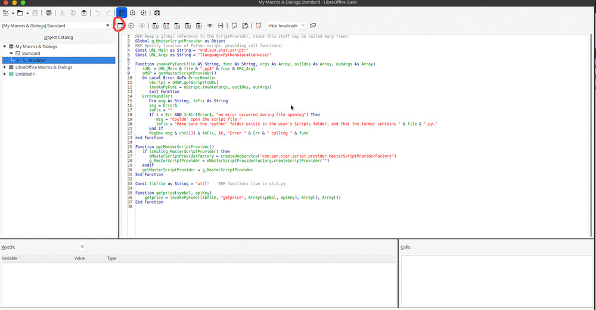

# LibreOffice Macro

This repo takes you through setting up a custom function in LibreOffice Calc. The function is written in Python but run using a
LibreOffice Basic bridge.

The script in this repo provides the =GETPRICE(WKN, APIKEY) function.
This reaches out to the [YH Finance API](https://rapidapi.com/apidojo/api/yh-finance/) and makes a request to `stock/v2/get-financials` to get the regularMarketOpen price for a particular WKN(stock id).

## How to Setup

* Launch LibreOffice Calc and navigate to the following menu: Tools > Macros > Edit Macros
* A text-editor like dialog box will launch as seen in the image below.
* Copy the contents of bridge.bas to Module1 of the Standard Library as seen below and click on compile.

* Navigate to your libreoffice user path. For linux, you can find it at `~/.config/libreoffice/4/user/Scripts` by default.
* create a `python` directory at this location if it does not already exist.
* copy the `util.py` file to the newly created directory, you should have the file at this path: `~/.config/libreoffice/4/user/Scripts/python/util.py`
* You should now have access to the getprice() function in LibreOffice Calc.

